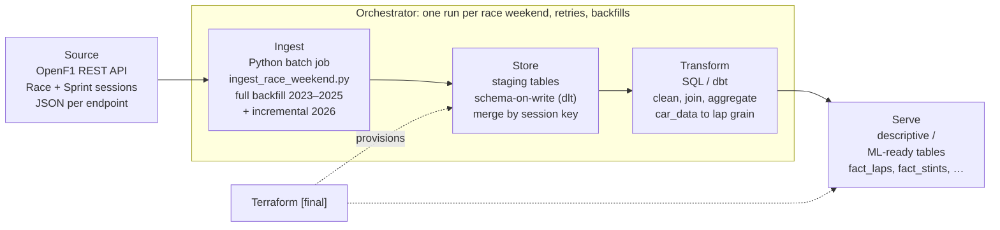

# F1 Race Strategy & Overtaking Analytics - End-to-End Batch Pipeline

DENG HS26 - Florian Item & Florian Leimer

## 1. Use case and user

**User / stakeholder:** an F1 team's race strategist (or a strategy-focused
fan analyst) who wants to understand, after each race weekend, how tyre
strategy and on-track position changes actually decided race outcomes.

**Problem:** raw lap-by-lap and telemetry data from a race weekend is too
granular and too large to reason about directly. The strategist needs a
curated view that answers two linked questions per circuit and per season:

1. How does each tyre compound degrade over a stint, and at what lap does
   the data suggest a pit stop (undercut/overtake) becomes worth it?
2. How hard is it to overtake at this circuit, and how much did grid
   position vs. race pace vs. strategy calls determine the final result?

**Data product:** a curated, queryable table (or small set of tables) at **one row per driver per lap per session**,
enriched with tyre compound and
age, weather at that point in the race, safety-car/flag status, and
lap-level aggregates of car telemetry (avg. throttle, % time at full
throttle, max speed, brake-event count for race session only). Supporting tables cover pit stops,
stints, and session results. This supports both descriptive analysis (degradation curves, overtaking-difficulty index
per circuit) and a stretch
ML use case (predicting the optimal pit-stop lap or lap time from stint
age + conditions).

## 2. Data source

- **Source:** [OpenF1 API](https://openf1.org/docs/) - free, unofficial,
  community-run REST API for Formula 1 data. Not affiliated with the F1
  companies.
- **Access method:** HTTP GET, JSON or CSV (`csv=true`), no authentication
  required for historical data (2023 season onward). Filterable by session,
  driver, and other attributes via query parameters. **Exception:** while any live F1 session (practice, qualifying,
  sprint or
  race) is in progress, access to **everything** is denied without a paid API
  key - including all historical data (HTTP 401 "Live F1 session in
  progress"). Free access returns once the session has ended.
- **Sessions used:** only the **Race** and **Sprint** sessions of a race
  weekend. Practice and qualifying laps are not used (the qualifying result
  only enters through `starting_grid`).
- **Endpoints used:**
    - `meetings`, `sessions` - look up the race weekend and its `session_key`s
    - `drivers` - driver ↔ team mapping (`dim_driver`, `dim_team`)
    - `laps` - lap duration, sector times, per-lap grain (core fact table)
    - `stints` - tyre compound, stint start/end lap, tyre age (degradation)
    - `pit` - pit stop lap and duration (pit window / undercut)
    - `position` - position changes over time, source for derived overtakes
    - `intervals` - gap to the car ahead (was an undercut within pit-loss range?)
    - `race_control` - flags and safety car, to exclude neutralised laps
    - `weather` - ~1 row/minute, track/air temperature, rainfall (degradation)
    - `session_result`, `starting_grid` - final classification vs. grid
      position. OpenF1 keys the grid on the *qualifying* session, so it is
      fetched from there and stored next to the Race/Sprint it belongs to.
    - `car_data` - high-frequency telemetry (~3.7 Hz per car), **Race session
      only**, fetched per driver and aggregated to lap grain during
      transformation
- **Not used:** `location` (no reliable lateral reference, very large),
  `overtakes` (only available during races), `team_radio`
  (coverage dropped sharply in 2026), all practice/qualifying laps.
- **Schema characteristics:** flat JSON records per endpoint, joinable via
  `session_key`, `meeting_key`, and `driver_number`. No documented schema
  versioning.
- **Update frequency:** new sessions/meetings appear as each 2026 race
  weekend happens, so the source grows throughout the semester. Data for
  completed sessions is static once published.
- **Volume:** most endpoints are tens to a few thousand rows per session (e.g. 2025 Austin Race: ~1,000 laps, ~20,000
  intervals). `car_data` is the
  only high-volume input at ~30,000+ rows per driver for a race (~130 MB of
  raw JSON per race weekend) - the reason lap-level aggregation is planned
  rather than storing raw telemetry in the curated layer.
- **Known data-quality risks:**
    - DRS status codes (2, 3, 9, 12, 14) are not fully documented/understood.
    - Rate limit of **3 requests/second** (HTTP 429 when exceeded, observed
      also under sustained load). The ingest script throttles and retries with
      backoff.
    - While a live F1 session is running, OpenF1 blocks **all** unauthenticated
      requests (HTTP 401, including historical data) until it ends. Ingestion
      must be scheduled outside live sessions (or use a paid API key). The
      ingest script aborts with the API's message in that case.
    - Telemetry cannot be requested for a whole session at once (HTTP 422
      "too much data"), it has to be fetched per driver.

### Ingesting the data

Ingestion means collecting the data from the OpenF1 API and saving the
responses unchanged as raw JSON files. It does not touch the database;
loading the files into the database is the
[store step](#3-initial-ingestion-and-storage-strategy).

- **Script:** `data/ingest_race_weekend.py` downloads the Race and Sprint
  sessions of one race weekend (meeting) into `data/raw`, one JSON file per
  endpoint/session.
- **Failure behaviour:** requests are throttled and retried with
  exponential backoff (429, 5xx, timeouts). A session folder gets a
  `_SUCCESS` marker (timestamp + row counts) only after all its endpoints
  were downloaded, the script exits non-zero otherwise. Already-downloaded
  files are skipped on re-run, so a failed ingestion is resumed simply by running
  it again (`--force` forces a re-fetch).

```bash
uv sync

# by year + name (substring of meeting name, location, country or circuit)
uv run data/ingest_race_weekend.py --year 2025 --meeting "monza"

# by year only: pick the meeting from a list
uv run data/ingest_race_weekend.py --year 2025

# or by OpenF1 meeting_key
uv run data/ingest_race_weekend.py --meeting-key 1268
```

| Flag               | Meaning                                  |
|--------------------|------------------------------------------|
| `--skip-telemetry` | don't fetch `car_data` (fast run, ~15 s) |
| `--out-dir`     | target directory (default `data/raw`)    |
| `--force`          | re-fetch files that already exist        |

If the name matches more than one meeting (e.g. `italy` → Imola and Monza),
the script lists the candidates and asks which one to fetch. If it matches
none, it lists all meetings of that year. When not run interactively (e.g.
from an orchestrator) it exits with the list instead - use `--meeting-key`
there.

> **Note:** during a live F1 session (any practice, qualifying, sprint or
> race) OpenF1 denies access to all data, including past seasons. The script
> then stops with `OpenF1 access denied: Live F1 session in progress…` -
> simply run it again after the session has ended.

## 3. Initial ingestion and storage strategy

The pipeline has three steps: **ingest** (OpenF1 API → raw JSON files, see
[Ingesting the data](#ingesting-the-data)), **store** (raw JSON → staging
tables in the database, unchanged) and **transform** (staging → curated
tables). The curated tables are what the pipeline **serves**: descriptive
and ML-ready tables for analysis (see [Architecture](#4-architecture-v01)).
The store step is not implemented yet.

- **Mode:** batch, per race weekend (meeting). A meeting is stored once its
  ingestion has completed.
- **Full vs. incremental:** incremental by session. Historical seasons
  (2023–2025) are ingested and stored once as a full backfill since they
  are static. The 2026 season is processed incrementally as new sessions complete,
  keyed on `session_key`/`meeting_key` so re-runs are idempotent
  (upsert/overwrite-by-key rather than blind append).
- **Local storage (midterm):** raw JSON from `data/raw` is loaded into
  PostgreSQL as a raw/staging layer before transformation.
- **Cloud storage (final):** the same steps load into BigQuery staging
  tables and transform into curated BigQuery tables. Local storage is
  used only for development/testing, never as a dependency of the production
  path.
- **Schema-on-write:** the database layers enforce a schema when data is
  loaded, not when it is queried. dlt maps each endpoint's JSON to typed
  staging tables, and its schema contract is set to reject new columns and
  type changes. Because OpenF1 has no documented schema versioning, source
  changes then fail the load visibly instead of silently reaching
  transformation. dbt models define the curated schema, with tests on keys
  and grain.
- **Failure behaviour (planned):** only session folders with a `_SUCCESS`
  marker are stored, so incomplete downloads never reach the database.
  Each session is loaded in one transaction.

## 4. Architecture v0.1

The pipeline runs batch, one race weekend (meeting) at a time. **Orchestrator**
orchestrates it: each step is an asset partitioned by meeting, so a single
race weekend can be re-run or backfilled on its own, with retries on
failure. Store and Serve run on PostgreSQL (Docker Compose) for the midterm
and on BigQuery for the final; the pipeline code stays the same, only the
destination changes.



**Serve: curated layer** (descriptive / ML-ready tables, same models in both
environments):

- `fact_laps` (grain: 1 row per driver/lap/session)
- `fact_pit_stops`, `fact_stints`, `fact_session_results`
- `dim_driver`, `dim_team`, `dim_session`, `dim_circuit`

## 5. Project plan / backlog (Week 3 → Week 7)

- [x] Confirm team roles and split ingest/store vs. transform ownership
- [x] Write ingest script for one race weekend (`data/ingest_race_weekend.py`)
- [x] Stand up local PostgreSQL + Docker Compose environment
- [ ] Write store step: load `data/raw` (sessions with `_SUCCESS`) into
  PostgreSQL staging tables
- [ ] Lap-level aggregation of `car_data`
- [ ] Define and implement first justified transformation (lap-grain fact
  table with tyre/weather/safety-car enrichment)
- [ ] Set up Orchestrator. Wire up ingest → store → transform as assets
  partitioned per meeting, with rerun/backfill support
- [ ] Draft Architecture v0.2 reflecting implementation decisions
- [ ] Write setup, execution, and verification instructions for midterm

## 6. Repository structure [TBD - update as it firms up]

```
/data           - ingest script: OpenF1 API → raw JSON (ingest_race_weekend.py)
/data/raw       - raw JSON downloaded by ingestion (gitignored)
/store          - dlt pipeline: loads data/raw into staging tables (planned)
/transform      - dbt project: cleaning/aggregation/modeling (planned)
/orchestration  - Orchestrator definitions: assets, meeting partitions, schedules
/infra          - Terraform (final milestone)
/docs           - architecture diagrams, decisions
README.md
.env.example
```

## 7. Limitations (known so far)

- OpenF1 is an unofficial, community-maintained API with no SLA and a
  3 requests/second rate limit. Ingestion reliability depends on its uptime.
- The free API is completely unavailable during live F1 sessions (all
  endpoints, including historical data), so ingestion can only run outside
  session times unless a paid API key is used.
- DRS and lateral-position telemetry fields have documented ambiguity and
  are not used for quantitative conclusions without caveats.
